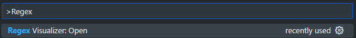
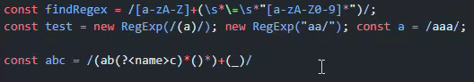
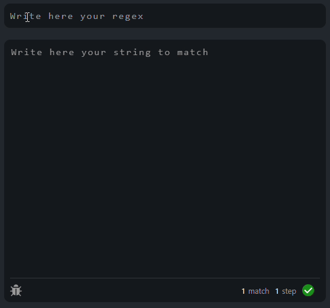
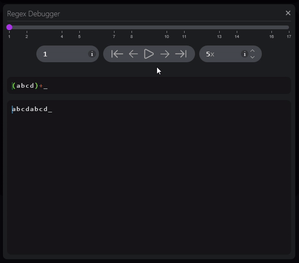

<div align="center">
    <p align="center">
        
    </p>
    <h1>RegeXer - Regex Visualizer & Debugger</h1>
    
    
    
</div>

## Visual Studio Code

**[Get from VSCode marketplace](https://marketplace.visualstudio.com/items?itemName=Kundros.regexer-extension)**

## Introduction

This is root of **RegeXer - Regex Visualizer & Debugger** extension for **Visual Studio Code**. Purpose of this project is to give programers tool built in VSCode to debug regular expressions in real time. This extension is still mostly work in progress and many features are not implemented, so please take that in consideration. Now this extension can only recognize some regular expressions, and only regexes for ECMAScript (JavaScript) specification. Parts that are not implemented yet, might be in future.

## Setup

If you're building this library on your own, you'll need to have installed NPM along with node.js minimal version 14.17, but it is recommended to use version >=20.

All commands expects you're using node package manager (NPM), replace NPM with alternative package manager if you want to (supporting node packages).

After cloning this repository, you can build this project with following commands:

### Download npm packages using command below in root:
```bash
npm i
# OR
npm install
```

### To build project simply use command below in root:
```bash
npm run build
```

### To create VSCode release of this project use command below in root:
```bash
npm run release
```
*Note: release files are located in ./libraries/regex-visualization-extension/release folder.*

## Usage

\
In command palette type "Regex Visualizer: Open", to open visualization window.

<p align="center">
    
</p>

\
Alternatively you can hover over regular expression in code. 
This will trigger hover pop-up with link to open regex visualization window.

<p align="center">
    
</p>

### Application window

Application window is the main page of regex visualization. You can interact with this window by writing your regular expressions along with text, where matching should be performed.

**Application initial view consists of:**
* Input for writing regular expressions. 
* Input for matching string.
* General information about parsing and matching progress. It is located at bottom of matching text input. 
* Debugger button, at the bottom left of matching input. This will trigger opening the debugger window, for the current input values. 

<p align="center">
    
</p>

### Debugger window

Debugger window can be opened by clicking at the gray debug button, at bottom of main page. This action will open window, in which you can see and browse history of match.

**Debugger window consists of:**
* Slider used to browse match history.
* Editable position/value of history/slider.
* Action buttons for quick slider manipulation, and it's history.
* Editable Auto-play speed. 
* Parsed regular expression text with highlighting.
* Matching string text with position highlighting. 

<p align="center">
    
</p>
