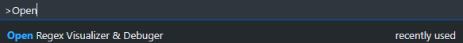
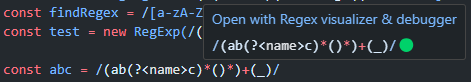
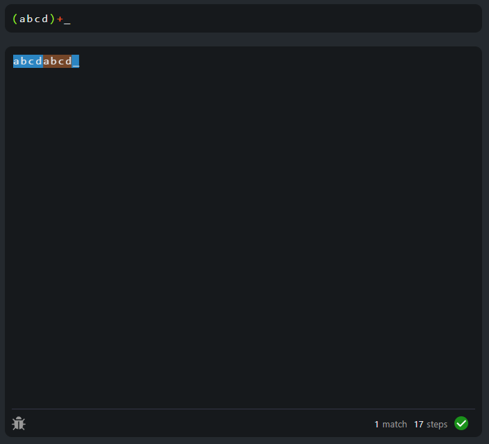

<div align="center">
    <h1>Regex visualisation extension for vscode</h1>
    <div align="center">
        
        
    </div>
</div>

## Introduction

This project is root for **regex visualisation extension for visual studio**. Its purpose is to give programers tool built in vscode to debug regular expressions in real time. Also this whole project is part of Thesis at VSB-TUO, by Dominik Kundra. All parts of this extension could be not fully-fledged so please take that in concideration. Now this extension can only recognise limited number of regular expressions, and only regular expressions for ECMAScript (JavaScript) specification. The parts that are not implemented, but might be in future are mainly lookarounds.

## Setup

If you're building this library on your own, you'll need to have installed NPM along with node.js minimal version 14.17, but it is recommended to use version >=20.

All commands expects using NPM package manager, replace NPM with alternative package manager if you want to (supporting node packages).

### Download npm packages using command below in root:
```bash
npm i
# OR
npm install
```

### To build project simply use command below in root:
```bash
npm run build
```

### To create VSCode release of this project use command below in root:
```bash
npm run release
```
*Note: release files are located in ./libraries/regex-visualization-extension/release folder.*

## Usage

<div style="text-align:center">
    
</div>

<div style="text-align:center">
    
</div>


<div style="text-align:center">
    
</div>