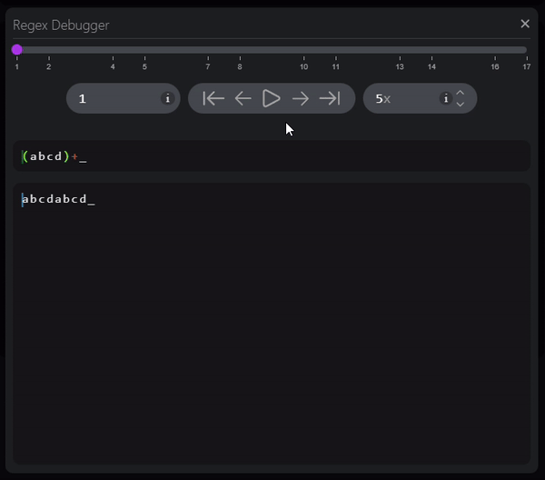

# RegeXer - Regex Visualizer & Debugger

This extension allows you to debug your regular expressions directly from vscode.

## Usage

\
In command palette type "Regex Visualizer: Open", to open visualization window.

    

\
Alternatively you can hover over regular expression in code. 
This will trigger hover pop-up with link to open regex visualization window.

    

### Application window

Application window is the main page of regex visualization. You can interact with this window by writing your regular expressions along with text, where matching should be performed.

**Application initial view consists of:**
* Input for writing regular expressions. 
* Input for matching string.
* General information about parsing and matching progress. It is located at bottom of matching text input. 
* Debugger button, at the bottom left of matching input. This will trigger opening the debugger window, for the current input values. 

    

### Debugger window

Debugger window can be opened by clicking at the gray debug button, at bottom of main page. This action will open window, in which you can see and browse history of match.

**Debugger window consists of:**
* Slider used to browse match history.
* Editable position/value of history/slider.
* Action buttons for quick slider manipulation, and it's history.
* Editable Auto-play speed. 
* Parsed regular expression text with highlighting.
* Matching string text with position highlighting. 

    

## Supports 
- **ECMAScript (JavaScript) regular expressions only**
- Basic syntax (groups, options, escaped characters, any character, list etc.)
- Separate webview to display regex and matched string
- real time regex parsing / matching
- async calls to match string for non-blocking webview
- hover on regular expression in your editor + link to that expression in visualization

## About

You should have basic knowledge about the regular expressions, but this extension can certainly help you understand regular expressions and how they handle matching strings. The visualization works by highlighting position in regular expression and in matching string, there are also displayed backtracking (state in regular expression from which no other path is possible).

## Future

This extension has many limitations, and isn't finished product, but there are plans for the future, updating this extension.